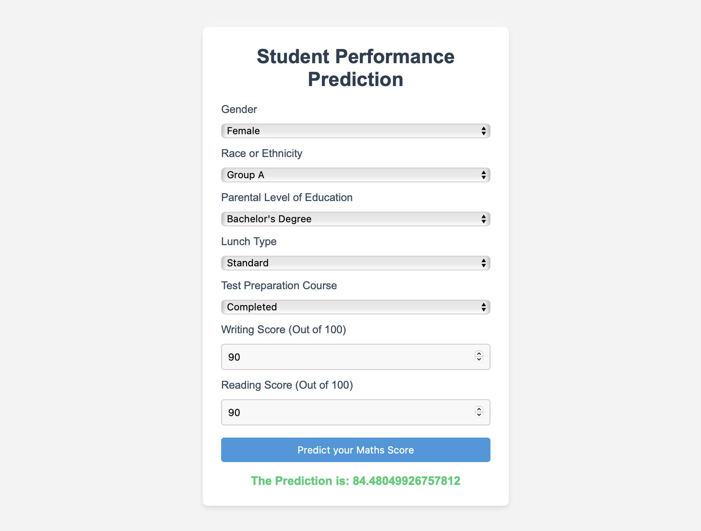

# Table of Contents

- [About The Project](#about-the-project)
- [About the Data](#about-the-data)
  - [Dataset Source Link](#dataset-source-link)
- [Technology Stack](#technology-stack)
- [Getting Started](#getting-started)
- [Installation Steps](#installation-steps)
  - [Option 1: Installation from GitHub](#option-1-installation-from-github)
  - [Option 2: Installation from DockerHub](#option-2-installation-from-dockerhub)
- [Setup](#setup)
  - [MLflow Tracking](#mlflow-tracking)
- [Usage and Configuration](#usage-and-configuration)
- [Contributing](#contributing)
- [License](#license)
- [Contact](#contact)
- [Acknowledgements](#acknowledgements)



## About The Project

The primary objective of this project is to develop a predictive model that can forecast the performance of students in their academic projects. The model aims to help educators and institutions identify students who may need additional support or intervention early in the project development process, ultimately enhancing overall student success.

## About the Data

- gender : sex of students -> (Male/female)
- race/ethnicity : ethnicity of students -> (Group A, B,C, D,E)
- parental level of education : parents' final education ->(bachelor's degree,some college,master's degree,- associate's degree,high school)
- lunch : having lunch before test (standard or free/reduced)
- test preparation course : complete or not complete before test
- math score
- reading score
- writing score

### Dataset Source Link

Dataset Url : `https://www.kaggle.com/datasets/spscientist/students-performance-in-exams?datasetId=74977`

## Technology Stack

- Pandas
- Numpy
- Scikit-learn
- Flask
- DVC
- MLFlow
- Seaborn
- Matplotlib

## Getting Started

This will help you understand how you may give instructions on setting up your project locally.
To get a local copy up and running follow these simple example steps.

## Installation Steps

### Option 1: Installation from GitHub

Follow these steps to install and set up the project directly from the GitHub repository:

1. **Clone the Repository**

   - Open your terminal or command prompt.
   - Navigate to the directory where you want to install the project.
   - Run the following command to clone the GitHub repository:
     ```
     git clone https://github.com/shubhamprajapati241/End-to-End-Student-Performance-Prediction
     ```

2. **Create a Virtual Environment** (Optional but recommended)

   - It's a good practice to create a virtual environment to manage project dependencies. Run the following command:
     ```
     conda create -p <Environment_Name> python==<python version> -y
     ```

3. **Activate the Virtual Environment** (Optional)

   - Activate the virtual environment based on your operating system:
     ```
     conda activate <Environment_Name>/
     ```

4. **Install Dependencies**

   - Navigate to the project directory:
     ```
     cd [project_directory]
     ```
   - Run the following command to install project dependencies:
     ```
     pip install -r requirements.txt
     ```

5. **Run the Project**

   - Start the project by running the appropriate command.
     ```
     python app.py
     ```

6. **Access the Project**
   - Open a web browser or the appropriate client to access the project.

<br><br>

### Option 2: Installation from DockerHub

If you prefer to use Docker, you can install and run the project using a Docker container from DockerHub:

1. **Pull the Docker Image**

   - Open your terminal or command prompt.
   - Run the following command to pull the Docker image from DockerHub:
     ```
     docker pull <Image_Name>
     ```

2. **Run the Docker Container**

   - Start the Docker container by running the following command, and mapping any necessary ports:
     ```
     docker run -p 5000:5000 <Container_Name>
     ```

3. **Access the Project**
   - Open a web browser or the appropriate client to access the project.

## Setup

### MLflow Tracking

We use MLflow to log and track our machine learning experiments. The MLFLOW_TRACKING_URI environment variable is set to the DagsHub repository's MLflow tracking URI.

```bash
export MLFLOW_TRACKING_URI=<MLFLOW_TRACKING_URI>

export MLFLOW_TRACKING_USERNAME=<MLFLOW_TRACKING_USERNAME>

export MLFLOW_TRACKING_PASSWORD=<MLFLOW_TRACKING_PASSWORD>
```

## Usage and Configuration

This project requires Amazon Web Services Access Key ID and Secret Access Key for interacting with AWS services. Follow these steps to configure your project to use AWS keys:

1. **Obtain Your AWS Access Key ID and Secret Access Key**:

   - Log in to the AWS Management Console.
   - Open the IAM (Identity and Access Management) dashboard.
   - Create a new IAM user or use an existing one.
   - Attach the necessary policies to the user.
   - Generate an access key for the user. Save these keys securely.

2. **Configuration**:
   - Store your AWS Access Key ID and Secret Access Key securely. Do not hardcode them directly in your code or expose them in public repositories. Instead, use environment variables or a configuration file to manage them securely.

## Contributing

Contributions are what make the open source community such an amazing place to learn, inspire, and create. Any contributions you make are **greatly appreciated**.

If you have a suggestion that would make this better, please fork the repo and create a pull request. You can also simply open an issue with the tag "enhancement".
Don't forget to give the project a star! Thanks again!

1. Fork the Project
2. Create your Feature Branch
3. Commit your Changes
4. Push to the Branch
5. Open a Pull Request

## License

Distributed under the MIT License. See `LICENSE.txt` for more information.

## Contact

Shubham Prajapati - [@shubhamprajapati7748@gmail.com](shubhamprajapati7748@gmail.com)

## Acknowledgements

We'd like to extend our gratitude to all individuals and organizations who have played a role in the development and success of this project. Your support, whether through contributions, inspiration, or encouragement, has been invaluable. Thank you for being a part of our journey.
